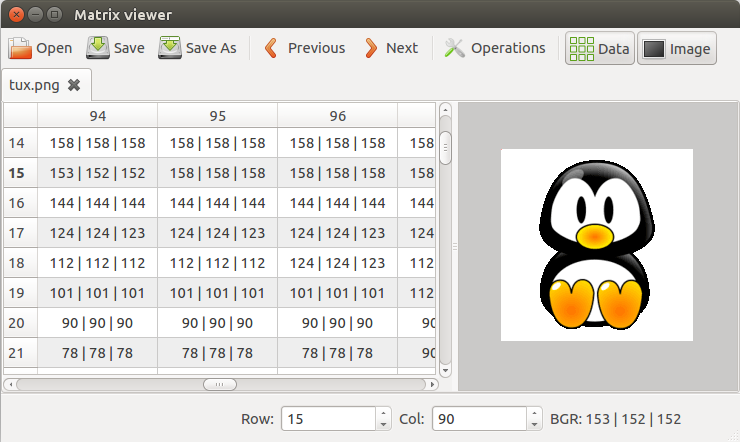

# Matrix-Viewer 
Frontend to [OpenCV](http://opencv.org/) matrices for visualization and edition as tabular or image data.

# Build and Run

* required packages: cmake; qt5 (core, widgets); libopencv-dev (2.4.11)
* optionnal packages: python-opencv

## Linux

>     git clone git://github.com/crep4ever/matrix-viewer.git
>     cd matrix-viewer
>     mkdir build && cd build
>     cmake .. && make
>     sudo make install
>     matrix-viewer

## CMake options

* CMAKE_BUILD_TYPE [ `Release` (default), `Debug`]
* GENERATE_MANPAGES [`ON` (default), `OFF`]: requires asciidoc; xmlto;
* COMPRESS_MANPAGES [`ON` (default), `OFF`]: requires gzip;
* OpenCV_DIR <Path>: absolute path to custom OpenCV build directory (windows)

## Integration with gdb
* copy the script misc/matrix-viewer-gdb.py in a local directory
* from a gdb shell, run: "source /path/to/matrix-viewer-gdb.py"
* the gdb command "mdv m" will launch matrix-viewer to open the cv::Mat 'm'

## Qt4 compatibility
The version 1.5.0 is the last release that is compatible with Qt4.
If your platform only has Qt4 support, checkout onto this tag:

>     git clone git://github.com/crep4ever/matrix-viewer.git
>     cd matrix-viewer
>     git checkout 1.5.0
>     mkdir build && cd build
>     cmake -DCMAKE_BUILD_TYPE=Release .. && make
>     sudo make install
>     matrix-viewer

# Documentation

The developer documentation can be generated with [Doxygen](www.doxygen.org).

* required packages: doxygen

>     cd matrix-viewer
>     doxygen Doxyfile
>     <browser> doc/html/index.html

# Contact
* romain.goffe@gmail.com
